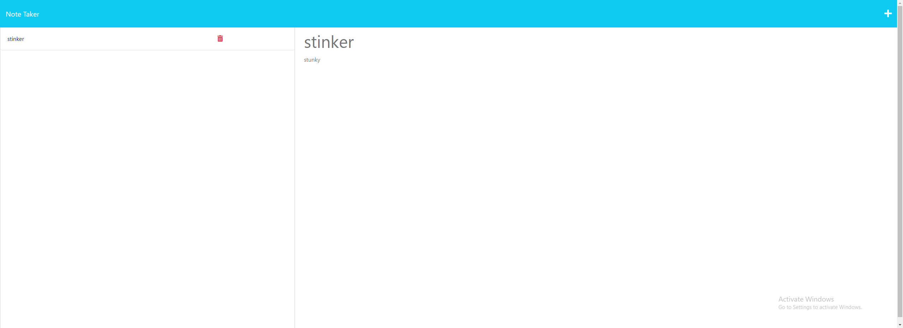

# Note-Taking Application



## Description

The Note-Taking Application is a web-based application that allows users to create, view, and delete notes. Users can access the application through a web browser and interact with the user-friendly interface to manage their notes effectively.

## Table of Contents

- [Installation](#installation)
- [Usage](#usage)
- [Features](#features)
- [Technologies Used](#technologies-used)
- [Contributing](#contributing)
- [License](#license)
- [Contact](#contact)

## Installation

To run the Note-Taking Application on your local machine, follow these steps:

1. Clone the repository to your local machine.
2. Navigate to the project directory.
3. Install dependencies using the following command:

``` npm install```

4. Start the server with the following command:

```npm start```

5. Open your web browser and access the application at [http://localhost:3000](http://localhost:3000).
  
6. Or view the deployed application on Heroku! https://polar-mountain-93462-902a00e5652c.herokuapp.com/ 

## Usage

- Upon accessing the application, you will be presented with a landing page containing a link to the notes page.
- Click on the link to the notes page to view a list of existing notes on the left-hand column.
- To create a new note, enter a title and the note's text in the right-hand column. A Save icon will appear in the navigation at the top of the page.
- Click the Save icon to save the new note, and it will be added to the list of existing notes.
- To view a note's content, click on the note in the left-hand column, and its content will be displayed in the right-hand column.
- To delete a note, click the Delete icon next to the note in the left-hand column.

## Features

- Create, view, and delete notes.
- User-friendly interface.
- Data persists using a JSON file as the database.
- Responsive design for a seamless experience across devices.

## Technologies Used

- Node.js
- Express.js
- HTML
- CSS
- JavaScript
- UUID for generating unique IDs

## Contributing

Contributions to the Note-Taking Application are welcome! To contribute, follow these steps:

1. Fork the repository.
2. Create your feature branch: `git checkout -b feature/your-feature`
3. Commit your changes: `git commit -m 'Add some feature'`
4. Push to the branch: `git push origin feature/your-feature`
5. Submit a pull request.

## License

This project is licensed under the [MIT License](link-to-license-file).

## Contact

For any questions or suggestions, please feel free to contact me:

[Github](https://github.com/liq543)
